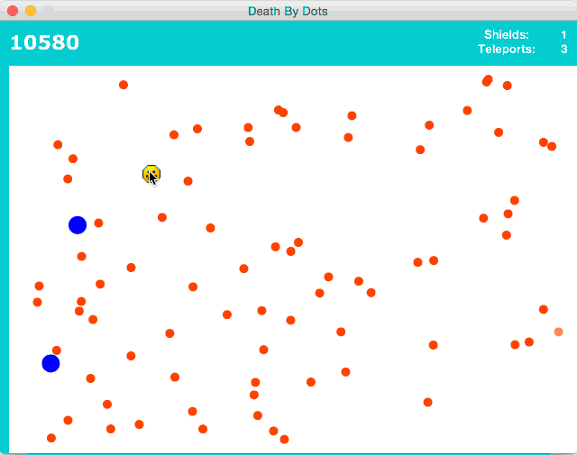
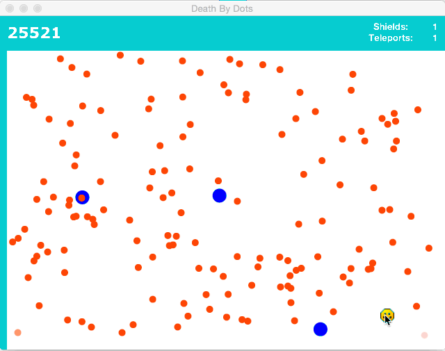
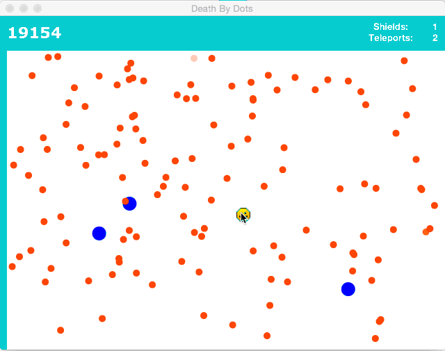
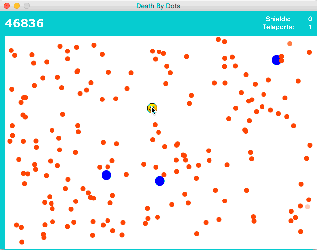

# DeathByDots
Mouse controlled dot dodging game with power ups. Created for Grade 11 ICS3U summative which was to create a game of our choosing in JavaFX.

Built by Zi Kai Chen

---

##Gameplay

Move the mouse and avoid the dots, and try to get the highest score. It's strangely addictive!

**Game start**

**Bombs**

Blue dots are your friend! They clear nearby orange dots for you.

###Power Ups

**Shield**

Left click: activates shield for 3 seconds. You only have 1 per game, use it to clear the board.

**Teleport**

Right click: move mouse freely; right click again to resume game. You have 3 such teleports per game, use them to escape messy situations.

##Game Ending

The game ends when you hit an orange dot. You can also see where you rank on the leaderboard.

